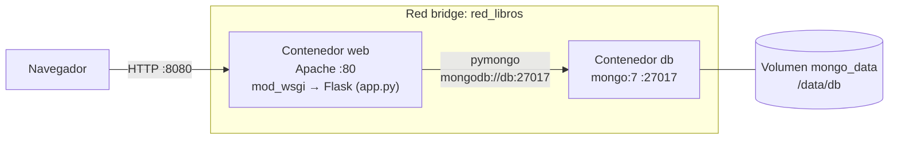

# TP Final Sistemas Operativos 2026

Aplicacion web para administrar libros (alta, consulta, modificacion y baja) desplegada con Docker Compose en dos contenedores:

- **web**: Apache HTTP Server + Python (Flask), ejecutado con `mod_wsgi`.
- **db**: MongoDB, imagen oficial `mongo:7`.

Cada libro tiene `id`, `titulo`, `cantidad_paginas`, `editorial`, `isbn` y `costo_usd`. El `id` es unico: la aplicacion muestra un error si se intenta repetir, tanto al dar de alta como al modificar.

## Estructura

```
TP_Sistemas_Operativos/
├── docker-compose.yml       # servicios web y db, red, volumen y variables de entorno
└── web/
    ├── Dockerfile           # FROM httpd:2.4 + Python + mod_wsgi
    ├── requirements.txt     # mod_wsgi, flask, pymongo
    ├── apache-libros.conf   # VirtualHost: Apache pasa las requests a la app Python
    ├── app.wsgi             # punto de entrada que ejecuta Apache
    ├── app.py               # rutas CRUD y conexion a MongoDB
    └── templates/
        ├── base.html        # layout comun y mensajes de error/exito
        ├── index.html       # listado de libros + formulario de alta
        └── edit.html        # formulario de modificacion
```

## Requisitos

- Docker
- Docker Compose (incluido en Docker Desktop; se usa como `docker compose`)

## Despliegue

```bash
git clone https://github.com/SantiagoTorricella/TP_Sistemas_Operativos.git
cd TP_Sistemas_Operativos
docker compose up --build -d
```

Abrir **http://localhost:8080**.

| Accion | Comando |
|---|---|
| Ver estado de los contenedores | `docker compose ps` |
| Ver logs de Apache | `docker compose logs web` |
| Detener (los datos se conservan) | `docker compose down` |
| Detener y **borrar los datos** | `docker compose down -v` |

## Diagrama de comunicacion



1. El navegador se conecta a `localhost:8080`. Compose mapea ese puerto al puerto 80 del contenedor `web` (`ports: "8080:80"`).
2. Apache recibe la request y, a traves de `mod_wsgi`, la ejecuta en la aplicacion Flask (`app.py`).
3. Flask consulta MongoDB usando el hostname `db`. En la red `red_libros`, Compose resuelve el nombre de cada servicio a la IP de su contenedor.
4. MongoDB guarda los datos en el volumen `mongo_data`, que sobrevive a `docker compose down`.

## Variables de entorno

Definidas en `docker-compose.yml`.

| Servicio | Variable | Valor | Para que sirve |
|---|---|---|---|
| db | `MONGO_INITDB_ROOT_USERNAME` | `admin` | Usuario administrador que se crea al iniciar MongoDB por primera vez |
| db | `MONGO_INITDB_ROOT_PASSWORD` | `admin123` | Contraseña de ese usuario |
| db | `MONGO_INITDB_DATABASE` | `libros_db` | Base de datos de la aplicacion |
| web | `MONGO_HOST` | `db` | Host de MongoDB |
| web | `MONGO_USER` | `admin` | Usuario con el que la app se conecta a MongoDB |
| web | `MONGO_PASSWORD` | `admin123` | Contraseña con la que la app se conecta |
| web | `MONGO_DB` | `libros_db` | Base de datos que usa la app (coleccion `libros`) |
